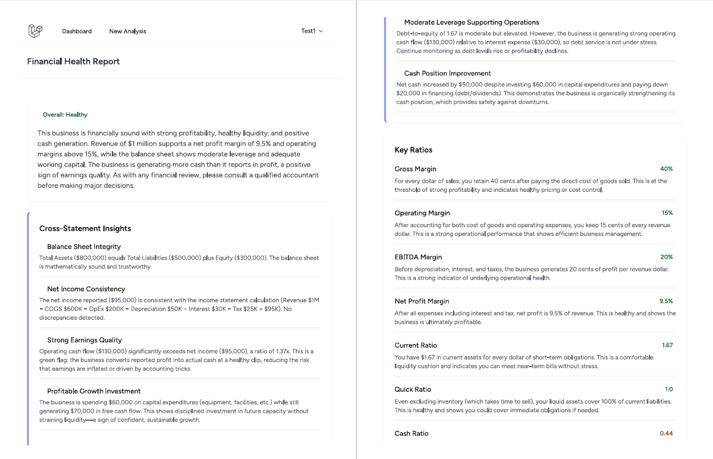
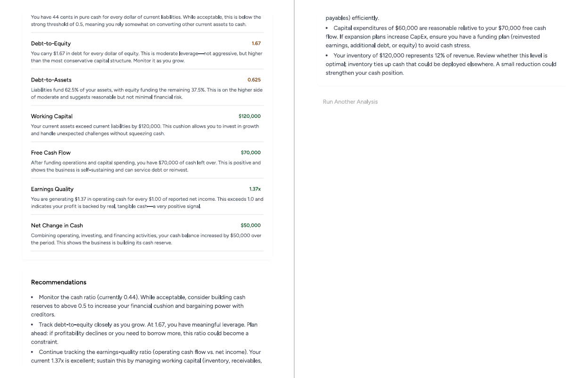

# AI Financial Statement Analyzer

A web application that turns raw financial statement figures into a clear, plain-English health report — powered by Anthropic's Claude API.

**Live demo:** http://34.224.41.92
*(Built for the CUA Vibe Coding Competition. Hosted on AWS EC2 Free Tier.)*





---

## The Problem

Small business owners, students, and non-financial managers regularly look at income statements, balance sheets, and cash flow statements without the training to interpret them. Key ratios like net profit margin, current ratio, debt-to-equity, and free cash flow carry real warning signs — but only if you know how to read them. Hiring an accountant for a quick gut-check is expensive and slow.

This app closes that gap: you enter the figures from your financial statements, and it returns an accountant-style health report written in language anyone can understand — including the specific ratios, what they mean for *your* numbers, warning signs, and concrete recommendations.

## What It Does

The analyzer offers four modes:

- **Income Statement** — gross, operating, EBITDA, and net profit margins.
- **Balance Sheet** — current, quick, and cash ratios, debt-to-equity, debt-to-assets, and working capital.
- **Cash Flow Statement** — free cash flow, net change in cash, and an earnings-quality check (operating cash flow vs. net income).
- **Integrated Analysis** — reviews all three statements together and adds a dedicated **Cross-Statement Insights** section that connects them, including automatic consistency checks (does the balance sheet balance? does net income agree across the income statement and cash flow statement?).

Every report includes:
- An overall health rating (*Healthy / Watch / Concern*)
- Key ratios, each with a color-coded value and a plain-English explanation of what it means for your business
- Warning signs derived from your actual figures
- Actionable recommendations
- For integrated analyses, cross-statement insights that only emerge from reading the statements together (e.g. strong reported profit but weak operating cash flow)

User accounts (via Laravel Breeze) keep each person's analyses tied to their login.

## How the AI Is Used

The core intelligence is the Anthropic Claude API (model: **Claude Haiku 4.5**). When a user submits figures, the app:

1. Collects and validates the input on the server.
2. Builds a structured prompt instructing Claude to act as a financial analyst, compute the ratios the provided figures support, and — in integrated mode — cross-reference the statements and run consistency checks.
3. Receives Claude's structured JSON response, stores it, and renders it as a formatted report.

The AI does the interpretation — computing and explaining ratios, identifying risks, running cross-statement consistency checks, and tailoring recommendations to the specific numbers entered — rather than relying on hard-coded rules.

## Tech Stack

| Layer | Technology |
|-------|-----------|
| Backend framework | Laravel (PHP 8.2+) |
| Authentication | Laravel Breeze |
| Database | SQLite (file-based, no separate DB server required) |
| Frontend | Blade templates, Tailwind CSS, Vite |
| AI | Anthropic Claude API (Claude Haiku 4.5) |
| Hosting | AWS EC2 (Ubuntu 24.04, t2.micro, Free Tier) |
| Web server | Nginx + PHP-FPM |

## Architecture Overview

```
User submits financial figures (Blade form)
        |
        v
AnalysisController  -->  validates input
        |
        v
AnthropicService    -->  builds prompt, calls Claude API
        |
        v
Analysis model      -->  stores input + AI report (SQLite)
        |
        v
Report view (Blade) -->  renders the plain-English health report
```

Key files:
- `app/Http/Controllers/AnalysisController.php` — request handling and validation
- `app/Services/AnthropicService.php` — prompt construction and Claude API calls
- `app/Models/Analysis.php` — the analysis record
- `resources/views/analyses/` — the input form and report views

Financial figures and the generated report are stored as JSON, so each statement type and the integrated mode share the same flexible schema.

## Local Setup

These steps let you run the project locally with SQLite (no database server needed).

```bash
# 1. Clone the repository
git clone https://github.com/nl7403/AI-Financial-Statement-Analyzer.git
cd AI-Financial-Statement-Analyzer

# 2. Install PHP and JS dependencies
composer install
npm install

# 3. Create your environment file and app key
cp .env.example .env
php artisan key:generate

# 4. Create the SQLite database file
#    (On Windows PowerShell, use: New-Item database/database.sqlite)
touch database/database.sqlite

# 5. In .env, set the database connection:
#      DB_CONNECTION=sqlite
#      DB_DATABASE=/absolute/path/to/database/database.sqlite
#    and add your Anthropic API key:
#      ANTHROPIC_API_KEY=your-key-here

# 6. Run database migrations
php artisan migrate

# 7. Build front-end assets
npm run build

# 8. Start the development server
php artisan serve
```

Then visit `http://127.0.0.1:8000`.

### Required environment variable

| Variable | Purpose |
|----------|---------|
| `ANTHROPIC_API_KEY` | Your Anthropic API key, used for all AI analysis calls |

## Deployment

The live demo runs on an AWS EC2 Free Tier instance:

- **Ubuntu 24.04** on a `t2.micro` instance
- **Nginx** serving the app from the `public/` directory, with **PHP-FPM** for PHP processing
- **SQLite** database stored on the instance (no RDS, to stay within Free Tier)
- Front-end assets compiled on the server with `npm run build`
- Cost controls: AWS billing alerts and an Anthropic API spend cap were configured before deployment to prevent surprise charges

## Security Notes

- Secrets (the Anthropic API key, app key) live only in the server's `.env` file, which is excluded from version control via `.gitignore` and never committed.
- The web server only exposes the `public/` directory; application code, the database file, and configuration sit outside the web root.
- Analysis features are behind authentication — a user must be registered and logged in to run an analysis.

## Limitations & Disclaimer

This tool provides automated, general-purpose financial commentary for educational and informational purposes. It is **not** professional financial, accounting, or investment advice. AI-generated analysis can be incomplete or wrong, and reports are only as accurate as the figures entered. Users should consult a qualified accountant or financial advisor before making real financial decisions — guidance the app itself repeats in its reports.

## Lessons Learned

- Deploying a Laravel app from scratch on a bare Linux server (Nginx, PHP-FPM, permissions, SQLite write access, Vite asset builds) involves a chain of small, easy-to-miss configuration steps — most "500" errors traced back to file permissions or missing compiled assets rather than the application code.
- Richer AI reports need a higher response token ceiling; the integrated analysis required raising it so the longer output could finish as valid JSON.
- Hiding form fields with CSS does not stop them from submitting — disabling the inputs of inactive sections was needed so each analysis only receives its own figures.
- Setting cost guardrails *before* provisioning cloud resources is far less stressful than reacting to a bill.
- Keeping a clean local -> GitHub -> server workflow, with git tags marking known-good states, made changes safe to ship and easy to roll back.

## Possible Future Work

- Inventory turnover and interest-coverage ratios (would require a couple of additional inputs).
- Saving and comparing analyses over time to track trends.
- Exporting reports to PDF.

## License

Released under the MIT License.
